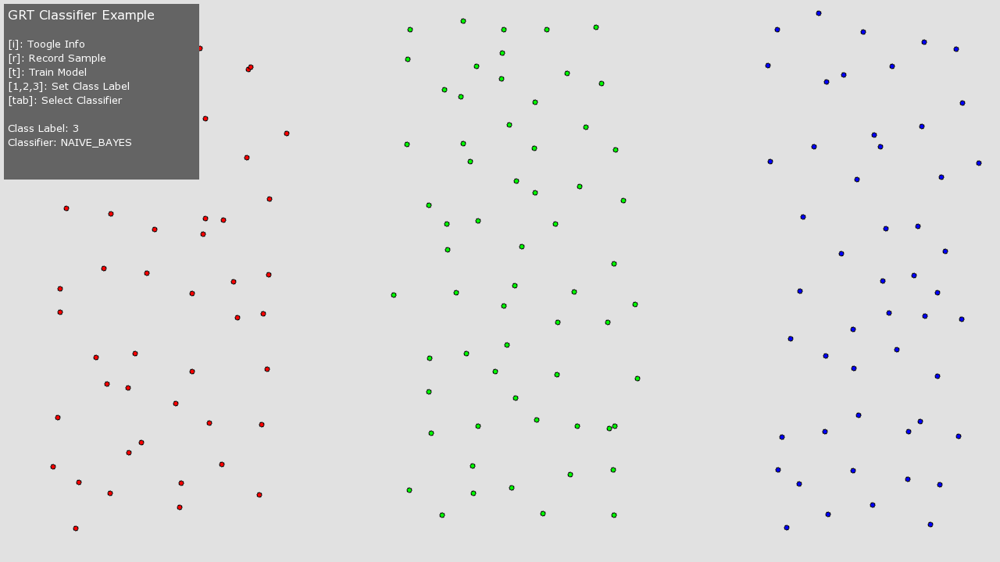
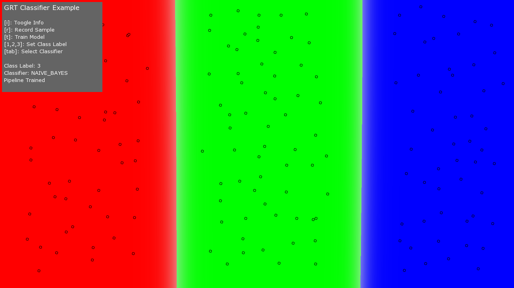
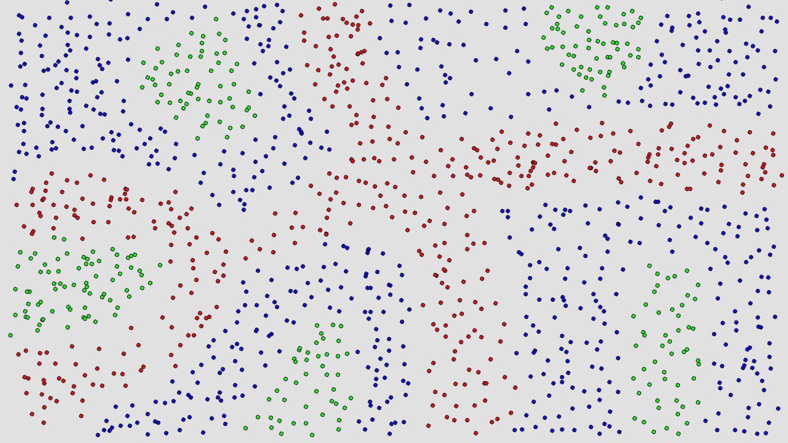
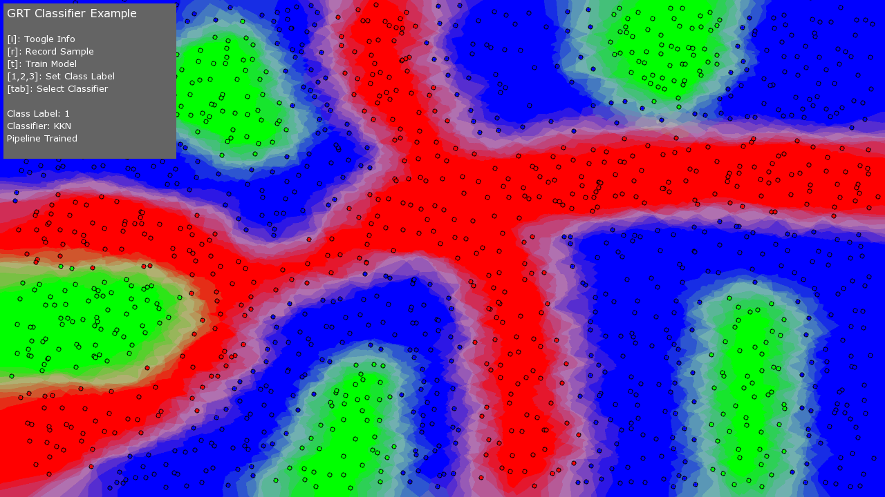
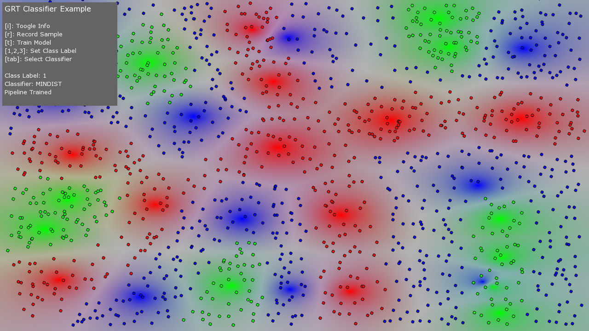
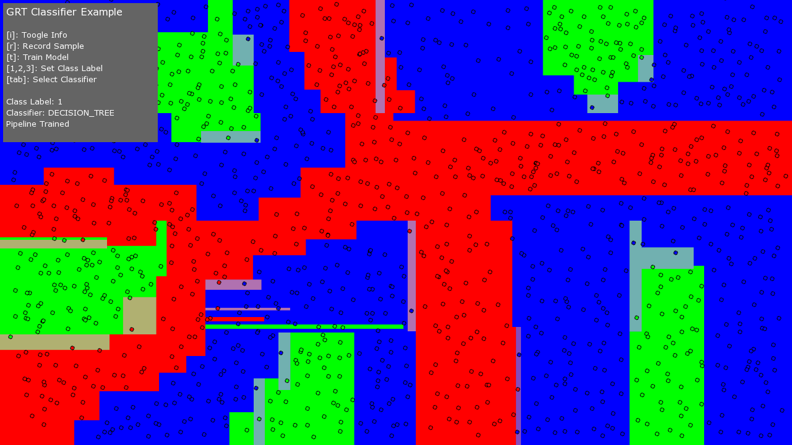
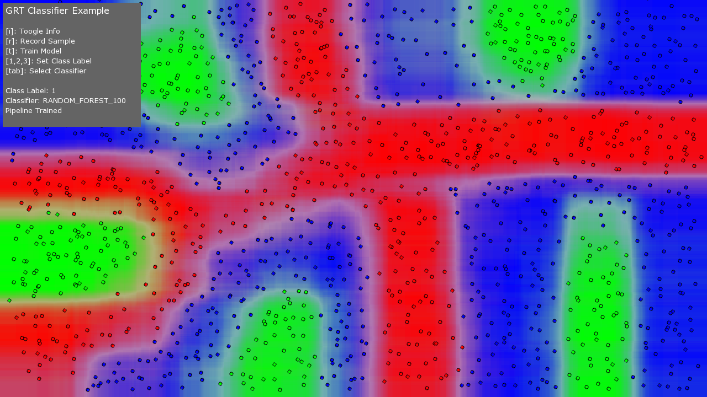

##Classifier Example

This example demonstrates the main GRT classification algorithms in one application.  

The example lets you experiment with several different GRT classification algorithms, namely:

1. Naive Bayes (ANBC)
2. MinDist
3. Random Forests (forest size: 10, 100, 200)
4. Softmax
5. Support Vector Machines (with both linear and radial basis function (RBF) kernels)
6. AdaBoost
7. Decision Tree
8. k-nearest neighbor (KNN)
9. Gaussian Mixture Model (GMM)

The example lets you add training data for up to 3 classes (defined by the [x y] coordinates of the mouse on the screen), train a classification model, and then classify all the pixels in the application window using the trained model. 

This example sets up a basic framework that allows you to classify a two dimensional input signal (the [x y] coordinates of the mouse on the screen), which is used to control the red, green and blue pixel colors on the screen.

This demonstrates the various decision boundaries learned by each classification algorithm, which should give a basic insite into the strengths and weaknesses of each classification algorithm.

The example lets you add training data to different regions of the screen, then use this training data to build a model which is then used to color all the pixels on the screen, as shown in the image below.


##Building and running the example
On OS X and Linux, you can build this example by running the following command in terminal:

````
cd THIS_DIRECTORY
make -j4
````

To run the example, run the following in terminal:

````
make run
````

##Using the example
To record a training example, simply move your mouse to a specific location in the app window and press the **r** key.  This will add one training example for the current class.  You can change the class label by pressing keys **1**, **2**, or **3**.  This will set the class color to red, green, or blue respectively.

Try adding several examples in a rough group, like the image below:





When you have recorded a few training examples for each class, press the **t** key to train a model for the currently selected classifier.

After the model has been trained, it will automatically color each pixel on the screen with the color of the most likely class, this should result in every pixel in the screen being colored which should look something like the image below:



To change the classifier type, use the **tab** key.

##Examples

###Non Linear Example

Here is a fairly complex 3 class, nonlinear, example.  The image below shows the training data, with each point representing a training sample and the color representing the class.


Non Linear Training Data

The images below show the results of using the dataset above to train a model for a number of GRT classifiers.  After training the model, each pixel on the screen is classified and colored with the likelihood of belonging to each class.


KNN (K=10)


MinDist


Random Forest (1 Decision Tree)


Random Forest (10 Decision Trees)


Random Forest (100 Decision Trees)


Random Forest (200 Decision Trees)