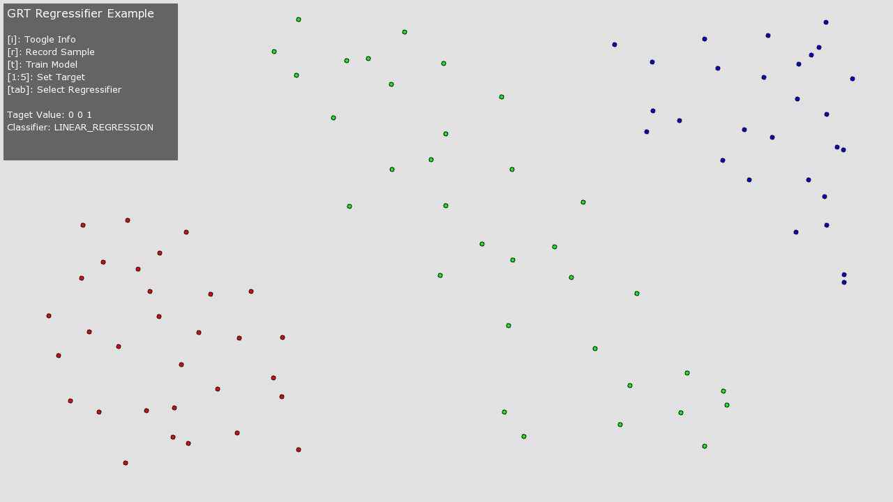
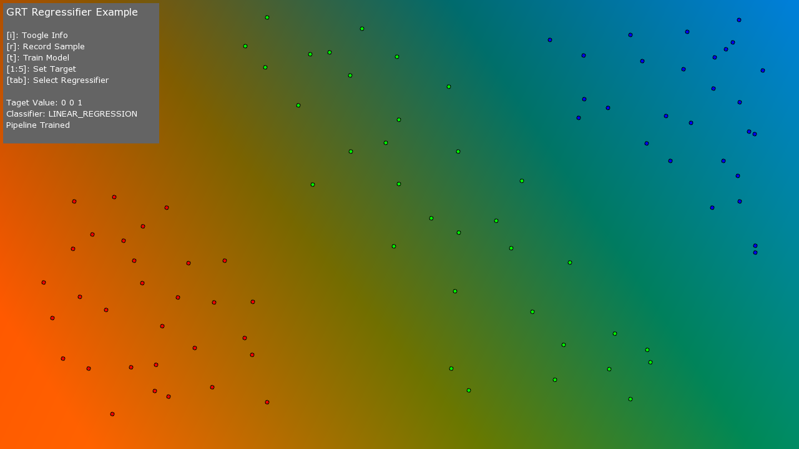
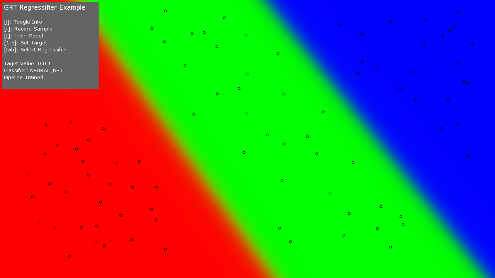
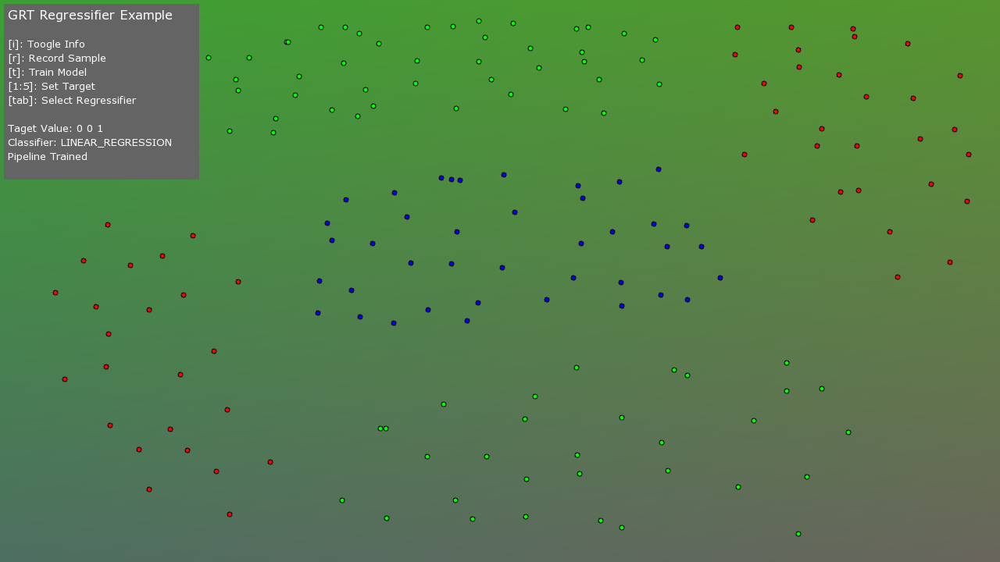

##Regression Example

This example demonstrates the main GRT regression algorithms in one application.  

The example lets you experiment with three different GRT regression algorithms, namely:

1. Linear Regression
2. Logistic Regression
3. Neural Network (Multilayer Perceptron)

The GRT regression algorithms enable you to take any N-dimensional input signal and map it to a K-dimensional output signal.

This example sets up a basic framework that allows you to map a two dimensional input signal (the [x y] coordinates of the mouse on the screen), to a three dimensional output signal (which is used to control the red, green and blue pixel colors on the screen).

The example lets you add training data to different regions of the screen, then use this training data to build a model which is then used to color all the pixels on the screen, as shown in the image below.


All regression algorithms have both strengths and weaknesses.  This simply example should demonstrate some important aspects of each algorithm, such as:

* does the algorithm support multi-dimensional inputs (all GRT regression algorithms do!)
* does the algorithm support multi-dimensional outputs (all GRT regression algorithms do, either inheriently like the MLP neural network, or via using the GRT MultidimensionalRegression meta algorithm)
* does the algorithm support non-linear mappings (Linear and Logistic regression do not, however the MLP does)
* is the algorithm stable (i.e., if you train it multiple times, do you get the same result each time, the MLP starts from random values each time, so its model can change significantly over multiple runs)

See the instructions below on how to build, run, and use the example.

##Building and running the example
On OS X and Linux, you can build this example by running the following command in terminal:

````
cd THIS_DIRECTORY
make -j4
````

To run the example, run the following in terminal:

````
make run
````

##Using the example
To record a training example, simply move your mouse to a specific location in the app window and press the **r** key.  This will add one training example for the current target output mapping (which is a 3 dimensional target that will be mapped to the red, green, blue pixel colors).

The default target mapping is [1 0 0], this is red=1, green=0, blue=0, which results in a red pixel.  Pressing the **r** key with this target mapping will add a training example at the current location of the user's mouse on the screen.  Try adding several examples in a rough group, like the image below:


You can try some other pre-defined target values by pressing the number 1:5 number keys.  For example, pressing the **2** number key will change the target to [0 1 0], which is red=0, green=1, blue=0, which results in a green pixel.  Try changing the target mapping by pressing the **2** number key and adding some more training examples (with this new target mapping) by moving your mouse to a new location and pressing the **r** key to add new examples, as shown in the image below:


Pressing the **3** number key will change the target to [0 0 1], which is red=0, green=0, blue=1, which results in a blue pixel.  Adding some new training examples (with this new target mapping) should result in something like the image below:



You can continue this for as many mappings and training examples as you like.  Once you have added enough training examples (which can be anything from just a few training examples to hundreds or thousands), you can then train a regression model.  To train a regresion model, press the **t** key.  This will train a regression model, which could take a few milliseconds to several minutes depending on the complexity and size of your training dataset.

When a model is trained, the application will then iterate over every pixel on the screen and color the pixel relative to the output of the model.  This should give you an output something like the image below:



You can see that the output of the regression algorithm **continually changes over the mapping space**.  This is a key feature of regression algorithms and can be used to create very powerful mapping from any N-dimensional input space to a K-dimensional output space.

The default regression algorithm is Linear Regression.  If you want to try the same training data on a different regression algorithm, then you can cycle through the regression algorithm using the **tab** key.  For example, press tab to move to the next algorithm and then press **t** to train a new model using the new regression algorithm. 

For example, this is what the mapping looks like when using the original training data with a MLP neural network:



##Strengths & Weaknesses
The GRT features a number of regression algorithms.  Each regression algorithm has its own strenths and weaknesses, so selecting the right regression algorithm for a specific task is an input factor in getting things to work.

One of the main factors for regression algorithms (and machine learning algorithms in general), is whether they can support non-linear functions.  For example, both linear and logistic regression do not perform well for non-linear mapping tasks, however, neural networks can support much more complex mapping tasks.

The image below shows a basic example for a non-linear mapping task, as there is clearly no easy way to draw a straight line between the two red clusters, without passing through the blue data. The same is true for the green data points.  


If this non-linear data is used to train a Linear Regression model, then the resulting model will perform badly, as the image below shows:



The image below shows the results for the same training data using Logistic Regression:


The image below shows the results for the same training data using the MLP neural network:


